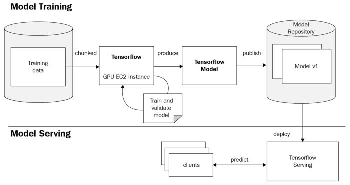
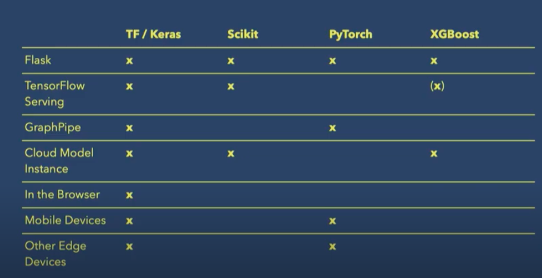

# Machine Learining model Deployment with tensorflow serving

## 1. Introduction

#### 1.1 What is Tensorflow Serving ?

TensorFlow Serving is a flexible, high-performance serving system for machine learning models, designed for production environments. TensorFlow Serving makes it easy to deploy new algorithms and experiments, while keeping the same server architecture and APIs. TensorFlow Serving provides out-of-the-box integration with TensorFlow models, but can be easily extended to serve other types of models and data.

#### 1.2 Why use tensorflow serving ?

- Highly scalable model serving solution
- Works well for large models up to 2GB
- Production ready Model Serving
- Model Version Control
- Consistent export format
- REST and gRPC endpoints
- Docker images are available for CPU and GPU hardware

#### 1.3 When to use Tensorflow Serving ?

This diagram compares various current frameworks for productionizing the machine learning models. 

Each framework has it's benefits and drawbacks.

## 2. Load and Preprocess
#### Dataset
https://www.kaggle.com/snap/amazon-fine-food-reviews

- We will only use "Score" and "Text" columns
## 3. 
